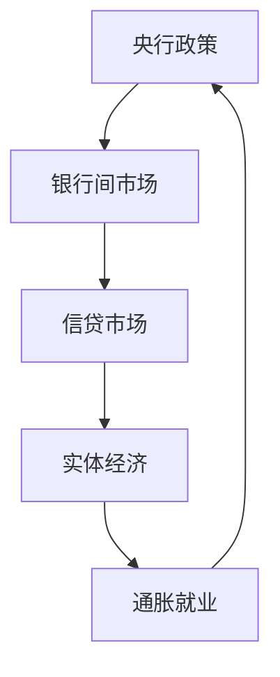

# 货币流动性监测

## 核心指标体系

| 指标           |     | 数据源                                 | 观察要点    | 政策含义   |
| ------------ | --- | ----------------------------------- | ------- | ------ |
| **M2货币供应**   |     | `ak.macro_china_money_supply()`     | 广义流动性总量 | 货币政策松紧 |
| **社会融资规模**   |     | `ak.macro_china_social_financing()` | 实体经济融资  | 信用环境   |
| **Shibor利率** |  | `ak.macro_china_shibor()`           | 银行间流动性  | 短期资金成本 |
| **LPR报价**    |     | `ak.macro_china_loan_prime_rate()`  | 贷款利率基准  | 政策传导效果 |
|              |     |                                     |         |        |

## 流动性传导机制


### 政策周期定位

| 不同周期特征 | Ｍ2与GDP关系                                 | 社会融资规模趋势 | 利率方向 |     |
| ------ | ---------------------------------------- | -------- | ---- | --- |
| 宽松     | $\triangle$$M_2$>$\triangle$$GDP_{name}$ | 持续扩张     | ↓↓   |     |
| 紧缩     | $\triangle$$M_2$<$\triangle$$GDP_{name}$ | 增量放缓     | ↑↑   |     |

### 政策利率
```mermaid
flowchart LR
    %% 顶层：政策总源头
    A[**央行**<br/>货币政策总闸门] ---> C[**市场利率传导层**<br/>市场交易形成实际资金价格]
    A --> B[**政策利率锚**<br/>央行直接定价 官方利率锚点]
    
    %% 市场利率传导层
    subgraph C[**市场利率传导层**<br/>市场交易形成实际资金价格]
        direction TB
        %% 第一级：银行间同业拆借市场
        C1[银行间同业拆借市场<br/>市场资金温度计]
        %% 第二级：信贷定价基准
        C2[信贷市场定价基准层<br/>实体贷款官方定价锚]
        %% 第三级：终端实体融资利率
        C3[终端实体融资利率<br/>企业/个人最终借贷成本]
        %% 同业市场子模块
    
        subgraph C1[**银行间同业拆借市场**<br/>市场资金温度计]
            direction TB
            C11[**DR007**:<br>银行间存款类机构7天期质押式回购利率<br/>同业拆借市场核心基准利率<br/>银行间实时成交利率，资金松紧实时风向标]
            C12[**FDR007**<br>银银间7天回购定盘利率<br>DR007官方定盘版<br>衍生品定价基准<br/>每日固定发布的公允定价锚]
            C13[补充参考指标<br/>**R007**:<br>全市场机构7天期回购利率<br/>**Shibor**:<br>上海银行间同业拆放利率]
        end
    end
        
        %% 政策利率层
    subgraph B[**政策利率基础层**<br/>央行直接定价 官方利率锚点]
        direction TB
        B1[OMO:公开市场操作<br/>核心品种：7天逆回购<br/>短期政策利率锚]
        B2[MLF:中期借贷便利<br/>核心品种：1年期<br/>中期政策利率锚]
    end
    B1 --1.调节**银行间**短期流动性<br/>锁定短期资金成本中枢--> C11
    


        %% 信贷基准子模块
        subgraph C2[**信贷市场定价基准层**<br/>实体贷款官方定价锚]
            direction TB
            C21[**LPR**:贷款市场报价利率<br/主要品种：1年期/5年期以上<br/>**LPR = MLF利率 + 银行加点**<br/>实体贷款合同通用定价基准]
        end

        %% 终端落地子模块
        subgraph C3[**终端实体融资利率**<br/>企业/个人最终借贷成本]
            direction TB
            C31[1年期LPR挂钩品种<br/>企业经营贷、普惠小微贷、短期流动资金贷]
            C33[5年期以上LPR挂钩品种<br/>个人住房贷款、中长期基建贷、大宗固定资产贷]
        end
    end

    %% 核心主传导链路
 
    C11 -.-> |注：底层数据完全同源<br/>每日编制形成官方定盘价| C12
    C11 --> |影响银行负债成本<br/>决定LPR加点幅度| C21
    C11 -.-> |围绕OMO利率波动<br/>央行货币政策核心观察目标| B1
    B2 --> |直接决定LPR定价母锚<br/>官方强制挂钩基准| C21
    C21 --> |贷款合同直接挂钩定价| C31
    C21 --> |贷款合同直接挂钩定价| C33
 


    
```


---
关联分析：[[01-宏观增长动力分析]] [[04-通胀就业形势判断]].
