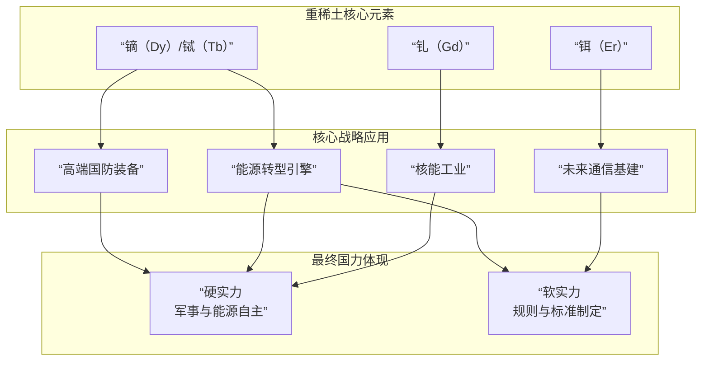

---
tags:
  - 稀土
  - 重稀土
  - 战略金属
Raw-Material:
  - 稀土
  - 钕
  - 镝
  - 铽
  - 钆
  - 铒
Data-Timestamp: "2026-06-26"
Confidence: "待验证"
---

```mermaid
flowchart TD
    subgraph A [重稀土核心元素]
        A1[“镝（Dy）/铽（Tb）”]
        A2[“铒（Er）”]
        A3[“钆（Gd）”]
    end

    subgraph B [核心战略应用]
        B1[“高端国防装备”]
        B2[“能源转型引擎”]
        B3[“未来通信基建”]
        B4[“核能工业”]
    end

    subgraph C [最终国力体现]
        C1[“硬实力<br>军事与能源自主”]
        C2[“软实力<br>规则与标准制定”]
    end

    A1 --> B1 & B2
    A2 --> B3
    A3 --> B4

    B1 --> C1
    B2 --> C1 & C2
    B3 --> C2
    B4 --> C1
```