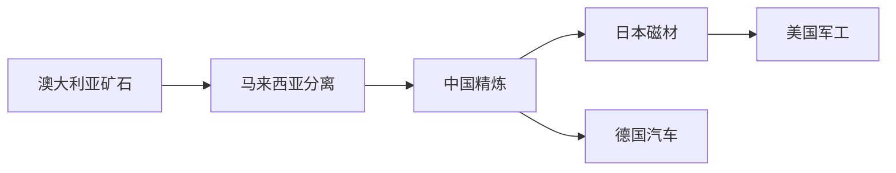
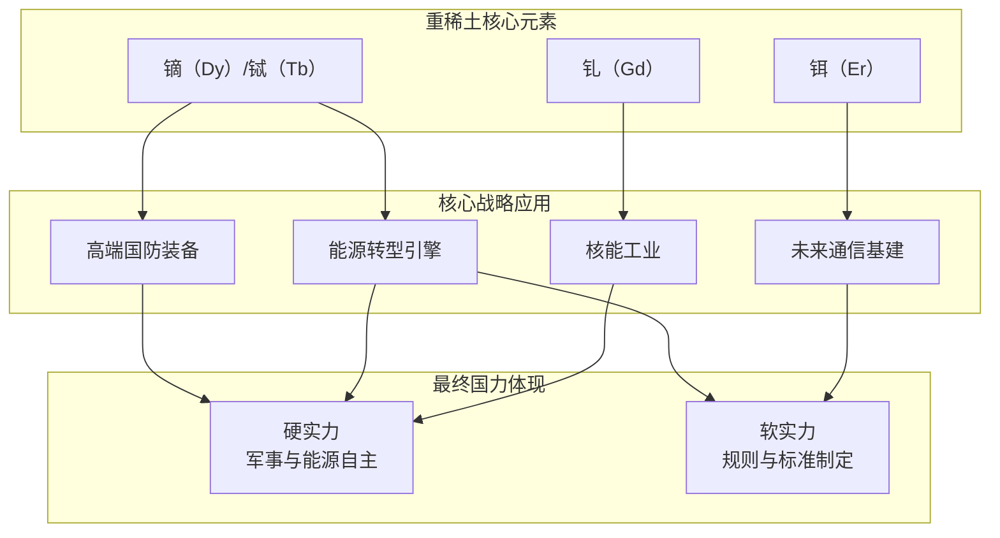

---
tags:
  - 稀土
  - 导航
Raw-Material:
  - 稀土
---

> [!example] 1. 稀土元素家族
> **轻稀土 (LREE)**：镧、铈、镨、钕
> - 主要链接：[[永磁体-钕铁硼]]、[[催化剂]]、[[抛光材料]]
> 
> **[[重稀土 (HREE)]] - 【战略核心】**：铽(Tb)、镝(Dy)、钆(Gd)
> - **概览重点应用节点**：
> 	- [[高端永磁体-添加剂]]：**镝(Dy)、铽(Tb)**，用于：
> 		- [[国防科技]]：战机发动机、精密制导、舰船电力系统
> 		- [[能源战略]]：高性能电动汽车、风力发电机
> 	- [[核能控制]]：**钆(Gd)**，用于核反应堆控制棒
> 	- [[未来通信]]：**铒(Er)**，用于光纤放大器

> [!example] 2. 产业链地图
> **采矿 → 选矿 → 分离提纯 → 金属/合金 → 功能材料 → 终端应用**
> *在每个环节创建笔记，标注核心技术、成本与主要玩家。*

## **第二层：动态博弈层 (The "Who" & "How")**

> [!example] 主要玩家档案
> 为每个主体创建独立笔记，模板如下：
> - **核心优势(护城河)**
> - **致命弱点**
> - **战略意图**
> - **关键盟友/对手**
> - **相关笔记**：[[中国稀土政策]] [[美国国防授权法案]]

> [!example] 全球供应链网络
> 

## **第三层：驱动力与规则层 (The "Why")**

> [!example] 核心驱动力
> - **需求侧**：[[能源转型]] [[国防现代化]] [[消费电子]]
> - **供给侧**：[[资源民族主义]] [[环境法规]]

> [!example] 规则与机制
> - **显性规则**：[[WTO规则]] [[出口管制]]
> - **隐性规则**：[[专利壁垒]] [[技术标准]]

## **第四层：战略推演层 (The "What If")**

> [!success] 情景规划
> - **情景A (中国强化主导)**：链接 [[缅甸政局]] [[深海采矿技术]]
> - **情景B (技术颠覆)**：链接 [[无稀土磁体]] [[回收技术突破]]
> - **情景C (绿色壁垒)**：链接 [[欧盟CRMA法案]] [[碳足迹核算]]

> [!todo] 监测指标
> - **价格**：氧化镨钕、氧化镝
> - **政策**：中国开采配额、美国国防法案
> - **技术**：主要公司研发投入、专利公告
> - **地缘**：缅甸局势、美日澳峰会

## **核心战略关联图**

## 补充产业链

- [[锆与氧化钇]] — 氧化钇（稀土分离产品）→ 钇稳定氧化锆 → 齿科/固态电池/核工业；日本东曹断供→国产替代窗口

## 最新深度分析

- [[稀土永磁出海分析]] — 《稀土与永磁，两个世界》（甲子申+报告帝 2026-06-21）：配额锁死+异形磁钢改变游戏规则+出海三条路径+核心结论（时间线错位是最大风险）
