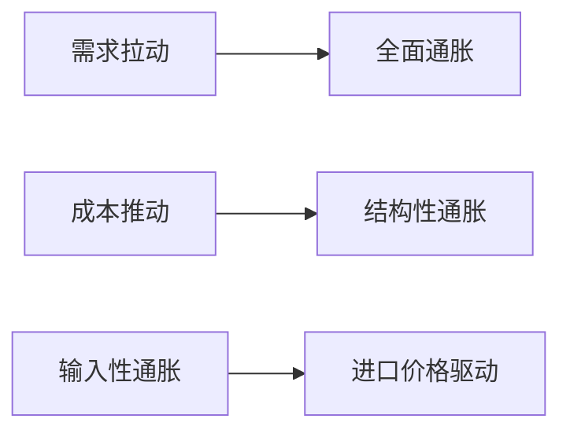

---
tags:
  - 投资研究
核心指标: ["CPI", "PPI", "城镇调查失业率", "居民收入"]
更新频率: 月度
---
# 通胀就业形势判断

## 核心指标体系

| 指标 | 数据源 | 观察要点 | 政策目标 |
|------|--------|----------|----------|
| **CPI消费者价格** | `ak.macro_china_cpi()` | 核心CPI、食品价格 | ~3% |
| **PPI生产者价格** | `ak.macro_china_ppi()` | 上游价格传导 | 合理区间 |
| **城镇调查失业率** | `ak.macro_china_unemployment_rate()` | 青年失业率 | <5.5% |
| **居民可支配收入** | `ak.macro_china_urban_disposable_income()` | 实际增长率 | >GDP增速 |

## 通胀类型识别

就业市场监测重点

- 青年群体就业压力
- 制造业与服务业就业结构变化
- 灵活就业规模与质量

---

关联分析：[[01-宏观增长动力分析]] [[02-货币流动性监测]]