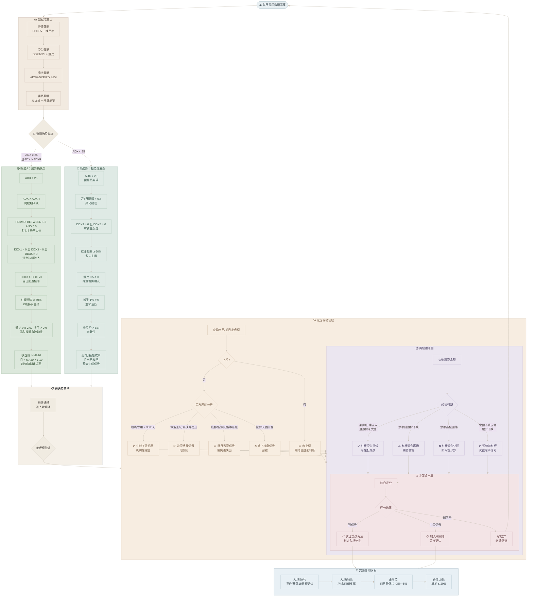

```mermaid
%%{init: {'theme': 'base', 'themeVariables': { 'background': '#F8F6F0', 'primaryColor': '#F0EBE1', 'primaryTextColor': '#4A4540', 'primaryBorderColor': '#D5CFC4', 'lineColor': '#C5BCB0', 'tertiaryColor': '#F5F0E8'}}}%%
flowchart TD
    Start([📊 每日盘后数据采集]) --> A[数据准备层]

    subgraph A[📥 数据准备层]
        A1[行情数据<br>OHLCV + 换手率] --> A2[资金数据<br>DDX1/3/5 + 量比]
        A2 --> A3[情绪数据<br>ADX/ADXR/PDI/MDI]
        A3 --> A4[辅助数据<br>龙虎榜 + 两融余额]
    end

    A4 --> B{🚦 选择选股轨道}

    B -->|ADX ≥ 25<br>且ADX > ADXR| C[轨道A：趋势确认型]
    B -->|ADX < 25| D[轨道B：趋势爆发型]

    subgraph C[🟢 轨道A：趋势确认型]
        C1[ADX ≥ 25] --> C2[ADX > ADXR<br>爬坡期确认]
        C2 --> C3[PDI/MDI BETWEEN 1.5 AND 5.0<br>多头主导不过热]
        C3 --> C4[DDX1 > 0 且 DDX3 > 0 且 DDX5 > 0<br>资金持续流入]
        C4 --> C5[DDX1 > DDX3/3<br>当日加速信号]
        C5 --> C6[红绿频率 ≥ 60%<br>K线多头主导]
        C6 --> C7[量比 0.8-2.0、换手 > 2%<br>温和放量有流动性]
        C7 --> C8[收盘价 > MA20<br>且 < MA20 × 1.10<br>趋势初期非追高]
    end

    subgraph D[🔵 轨道B：趋势爆发型]
        D1[ADX < 25<br>蓄势待突破] --> D2[近5日振幅 > 6%<br>异动初现]
        D2 --> D3[DDX3 > 0 且 DDX5 > 0<br>有资金沉淀]
        D3 --> D4[红绿频率 ≥ 60%<br>多头主导]
        D4 --> D5[量比 0.5-1.0<br>缩量蓄势确认]
        D5 --> D6[换手 1%-4%<br>温和活跃]
        D6 --> D7[收盘价 > BBI<br>未破位]
        D7 --> D8[近5日振幅收窄<br>且当日收阳<br>蓄势完成信号]
    end

    C8 --> E[📋 候选股票池]
    D8 --> E

    subgraph E[📋 候选股票池]
        E1[初筛通过<br>进入观察池] --> E2{龙虎榜验证}
    end

    subgraph F[🔍 龙虎榜验证层]
        F1[查询当日/前日龙虎榜] --> F2{上榜?}
        F2 -->|是| F3{买方席位分析}
        F2 -->|否| F4[⚠️ 未上榜<br>需结合盘面判断]
        F3 -->|机构专用 &gt; 3000万| F5[✅ 中线关注信号<br>机构在建仓]
        F3 -->|章盟主/方新侠等善庄| F6[✅ 游资格局信号<br>可跟随]
        F3 -->|成都系/溧阳路等恶庄| F7[⚠️ 隔日游资信号<br>需快进快出]
        F3 -->|拉萨天团接盘| F8[❌ 散户接盘信号<br>回避]
        F4 & F5 & F6 & F7 & F8 --> G
    end

    E2 --> F

    subgraph G[💰 两融验证层]
        G1[查询融资余额] --> G2{趋势判断}
        G2 -->|连续3日净流入<br>且股价未大涨| G3[✅ 杠杆资金潜伏<br>潜在起爆点]
        G2 -->|余额随股价下跌| G4[⚠️ 杠杆资金离场<br>需要警惕]
        G2 -->|余额高位回落| G5[❌ 杠杆资金兑现<br>阶段性顶部]
        G2 -->|余额不降反增<br>股价下跌| G6[✅ 逆势加杠杆<br>洗盘尾声信号]
        G3 & G4 & G5 & G6 --> H
    end

    F --> G

    subgraph H[🎯 决策输出层]
        H1[综合评分] --> H2{评分结果}
        H2 -->|强信号| H3[📈 次日重点关注<br>制定入场计划]
        H2 -->|中等信号| H4[📋 加入观察池<br>等待确认]
        H2 -->|弱信号| H5[🗑️ 放弃<br>继续筛选]
    end

    H3 --> I[📝 输出交易计划]
    H4 --> I
    H5 --> Start

    subgraph I[📝 交易计划模板]
        I1[入场条件:<br>竞价/开盘15分钟确认] --> I2[入场价位:<br>均线/前低支撑]
        I2 --> I3[止损位:<br>前日最低点 -3%~-5%] --> I4[仓位比例:<br>单笔 ≤ 20%]
    end

    %% 样式定义
    classDef start fill:#E8EFF2,stroke:#C5D4DB,color:#3D4A50,stroke-width:1.5px
    classDef data fill:#F2EAE0,stroke:#DCCFC4,color:#5A4F45,stroke-width:1.5px
    classDef trackA fill:#DCE8DC,stroke:#BDD0BD,color:#3A553A,stroke-width:1.5px
    classDef trackB fill:#DFEAE5,stroke:#C2D5CB,color:#3D5A4E,stroke-width:1.5px
    classDef lb fill:#F7EDE1,stroke:#E3D3C2,color:#7A624D,stroke-width:1.5px
    classDef margin fill:#EBE6F0,stroke:#D5CCE0,color:#4A4060,stroke-width:1.5px
    classDef decision fill:#F3E4E6,stroke:#DFC9CC,color:#6B474A,stroke-width:1.5px
    classDef output fill:#E8F0F5,stroke:#C5D4DB,color:#3D4A50,stroke-width:1.5px

    class Start start
    class A,A1,A2,A3,A4 data
    class C,C1,C2,C3,C4,C5,C6,C7,C8 trackA
    class D,D1,D2,D3,D4,D5,D6,D7,D8 trackB
    class F,F1,F2,F3,F4,F5,F6,F7,F8 lb
    class G,G1,G2,G3,G4,G5,G6 margin
    class H,H1,H2,H3,H4,H5 decision
    class I,I1,I2,I3,I4 output
```