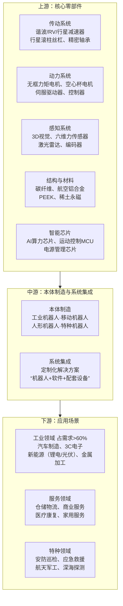

---
tags:
  - 人形机器人
  - 具身智能
  - AI
  - 智能制造
Raw-Material:
  - 稀土
  - 钕
Functional-Material:
  - 钕铁硼
  - 伺服电机
Impact-Direction:
  - material: 稀土
    cost_side: "伺服电机/传感器制造商"
    benefit_side: "稀土永磁供应商"
Data-Timestamp: "2026-06-26"
Confidence: "待验证"
Component:
  - 人形机器人
  - 机器人
---

# 人形机器人与具身智能

> [!note] 来源说明
> 本文件整合自 IMA 知识库中 3 篇人形机器人相关文章的提炼内容。

## 行业爆发节点

### 2026：人形机器人 VC 投资超 2025 全年

仅 2026 年 4 月，中国就出现 **41 起**人形机器人融资事件：
- 2025 年同期：16 起
- 2024 年同期：6 起

### 资本逻辑转变

从"看 Demo"转向：
- 量产能力
- 供应链成熟度
- 商业化落地

## 真实场景落地

### 工业制造

| 企业 | 应用 |
|------|------|
| BMW | 测试 Hexagon 机器人 |
| Siemens | 测试工厂物流机器人 |
| Schaeffler | 计划部署 1000 台 AEON 机器人 |

### 机场物流

日本航空开始测试机场搬运机器人

### 家庭机器人

- 1X：正在建设 10 万台级工厂
- Figure：正在建设 BotQ 机器人产线

## Tesla Optimus：全球行业风向标

> [!important] Tesla 综合优势
> - AI 能力
> - 制造能力
> - 数据能力
> - 电池与驱动系统
> - 自动化生产能力

**现状**：
- Gen3 设计仍未最终确定
- 腱驱动灵巧手方案已经修改
- 量产节奏可能慢于市场预期

## 中国供应链优势

中国正在成为全球人形机器人产业链中心，核心零部件高度集中：

- [[电机]]
- [[减速器]]
- [[传感器]]
- [[丝杠]]
- [[电池]]
- [[灵巧手]]
- [[结构件]]
- [[AI 硬件]]

### 护城河转移

中国玩家的护城河正在从**硬件**转向"**真实机器人数据飞轮**"

> [!note] 数据飞轮重要性
> - 机器人数据极其稀缺
> - 真机训练成本极高
> - 谁能最快规模化部署机器人，谁就能获得最多真实世界数据

## 机器人大脑：最大变量

目前主流路线：
- **World Model**：世界模型
- **VLA（Vision-Language-Action）**：视觉-语言-动作模型

**瓶颈**：还远远不足以支撑高精度工业任务

**短期判断**：Hybrid AI + Rule-based 系统仍会长期存在

## Big Tech 入局

- **Meta**：收购 ARI（机器人基础模型公司）
- **Skild AI**：收购 Fetch Robotics 资产
- **Amazon / Jeff Bezos**：全面押注"[[Physical AI]]"

## 产业路径

人形机器人正在复制新能源汽车产业路径：
- 资本疯狂涌入
- 供应链快速成熟
- 政策强力推动
- 龙头厂商扩产
- 成本快速下降
- 产品快速迭代

### 价格拐点

Unitree 已把机器人价格打到 **4000 美元**级别

## 市场展望

> [!quote] 产业规模
> Humanoids: A $5 Trillion Global Market

人形机器人可能像汽车、智能手机、PC 一样成为通用平台，未来可能进入：
- 制造业
- 家庭
- 服务业
- 物流
- 医疗
- 老龄化护理

## 九大核心零部件及企业

> [!note] 来源补充
> 以下企业清单来自公众号「发现下一片绿洲」《人形机器人 九大行业龙头》信息图。

### 1. [[传感器]]

- 细分类型：六维力传感器、视觉传感器、触觉传感器
- 相关企业：坤维科技、蓝点触控、柯力传感、奥比中光、宇立仪器、天准科技、豪威科技、汉威科技

### 2. [[丝杠]]

- 细分类型：主流技术路线是滚珠丝杠、行星滚柱丝杠
- 相关企业：五洲新春、北特科技、鼎智科技、江苏雷利、南京工艺、双林股份、贝斯特

### 3. [[电机]]

- 细分类型：伺服电机、无框力矩电机、空心杯电机
- 相关企业：汇川技术、雷赛智能、鸣志电器

### 4. [[减速器]]

- 细分类型：谐波减速器、RV 减速器、行星减速器
- 相关企业：绿的谐波、中大力德

### 5. [[轴承]]

- 相关企业：五洲新春、长盛轴承、南方精工、国机精工、苏轴股份、龙溪股份

### 6. [[执行器总成]]

- 细分类型：旋转执行器、线性执行器、关节模组
- 相关企业：三花智控、拓普集团、恒立液压、中坚科技、雷赛智能、大族电机、微精电机、伟达立

### 7. [[结构件]]

- 细分类型：PEEK 材料、精密结构件
- 相关企业：中研股份、新瀚新材、沃特股份、蓝思科技、领益智造、长盈精密、立讯精密、宁波华翔、祥鑫科技

### 8. [[芯片与模型算法]]

- 芯片企业：瑞芯微、全志科技、英伟达、地平线、高通
- 具身大模型：宇树科技、智元机器人、智平方、自变量、银河通用、DeepMind

### 9. [[人形机器人整机]]

- 优必选、宇树科技、智元机器人、银河通用、千寻智能、智平方、自变量
- Tesla、傅利叶、小鹏机器人、乐聚
- Figure AI、Agility、波士顿动力

## 2026Q1 零部件企业营收

| 企业 | 营收（亿元） | 领域 |
|------|-------------|------|
| 三花智控 | 77.70 | 执行器/热管理 |
| 富临精工 | 50.50 | 锂电/负极 |
| 卧龙电驱 | 39.86 | 电机 |
| 双环传动 | 20.95 | 齿轮/传动 |
| 江苏雷利 | 10.44 | 丝杠/微特电机 |
| 双林股份 | 11.52 | 丝杠 |
| 五洲新春 | 7.22 | 轴承/丝杠 |
| 鸣志电器 | 7.00 | 电机/驱动 |
| 雷赛智能 | 5.20 | 运动控制 |
| 长盛轴承 | 3.50 | 轴承 |
| 中大力德 | 2.42 | 减速器 |

---

## 行业名词速查

> [!note] 来源
> 公众号「发现下一片绿洲」人形机器人行业名词科普图。

> [!tip] 快速记忆口诀
> 本体是身，伺服是肌，传感器是神经，灵巧手是手，VLA 是脑，Sim-to-Real 是训练场，WBC 是全身协调，**量产元年是当下**（2025-2026 年是行业共识的量产元年）

### 技术架构类

| 类型 | 主要特点 |
|------|----------|
| 具身智能 | AI 从"纯大脑"进化到"有身体"，能感知物理世界并与之交互；人形机器人是具身智能的主要载体 |
| 灵巧手 | 机器人末端的多自由度手部，通常 10-20+ DoF，模拟人手抓取、捏取、操作物体等动作 |

### 软件/算法类

| 类型 | 主要特点 |
|------|----------|
| 模仿学习 | 机器人通过观察人类动作（视频/动作捕捉）学习技能，降低编程成本 |
| VLA 模型 | 视觉+语言+动作的多模态大模型，机器人"看到画面+听懂指令→做出动作"，是具身智能的大脑 |
| 强化学习 | 机器人在仿真环境中试错数百万次，通过奖励/惩罚优化动作策略，再迁移到真实机器人 |

### 商业模式类

| 类型 | 主要特点 |
|------|----------|
| RaaS | Robot-as-a-Service，以租赁/订阅模式提供机器人服务 |
| 本体厂商（OEM） | 研发制造机器人硬件整机 |
| 智能方案商 | 提供算法、软件、系统集成方案 |

## 相关文件

- [[半导体结构总览]] — 芯片产业链导航地图
- 产业链全景地图

---
*本文档由 IMA 知识库文章及公众号「发现下一片绿洲」信息图整理生成*

## 具身机器人 PCB 板全景

> [!note] 来源说明
> 本节整理自信息图《具身机器人 PCB 板全景拆解》。

### PCB 板五大分类

| 类别 | 功能 | 典型芯片/组件 | 协作对象 |
|------|------|--------------|----------|
| 核心主板 | 主控计算、AI 推理 | SoC/AI 加速芯片 | 全局调度 |
| 感知类 PCB | 视觉/触觉/力觉信号采集 | 图像传感器、六维力传感 IC | 传感器 → 主控 |
| 运动控制类 PCB | 伺服驱动、FOC 电机控制 | 电机驱动 IC、编码器 | 主控 → 电机 |
| 电源与安全类 PCB | 电池管理、功率分配 | BMS IC、DC-DC | 电池 → 各板 |
| 通信与总线类 PCB | 板间高速通信 | 以太网/CAN/串行总线 IC | 板间数据流 |

### 机器人身体各部位 PCB 分布

| 身体区域 | PCB 板 |
|----------|--------|
| 头部 | 视觉感知主板、摄像头接口板 |
| 肩部 | 伺服驱动板、FOC 电机控制板 |
| 胸腔/上躯干 | 主控计算板、AI 加速板、通信背板/交换板 |
| 四肢关节 | 关节驱动板、编码器接口板 |
| 手部 | 灵巧手控制板、触觉传感板 |
| 足部 | 六维力传感板、平衡控制接口板 |

### 躯干核心层爆炸分解

主控计算板、AI 加速板、通信背板/交换板等 7 层 PCB 垂直堆叠，类似服务器主板架构。

### 神经系统类比

| 人体系统 | 机器人对应 |
|----------|-----------|
| 大脑 | 主控计算板 + AI 加速板 |
| 神经 | 通信总线与信号链路 |
| 感官 | 传感器 + 感知 PCB |
| 肌肉 | 电机 + 运动控制 PCB |
| 心脏/血管 | 电池 + 电源管理 PCB |

### 典型系统参数

- 主电压：48V / 24V
- 峰值功率：数百瓦级
- 通信拓扑：以太网 + CAN 总线混合

---

## IMA 补充内容（2026-06-21）

> [!note] 来源
> 《人形机器人爆发前夜：全球巨头开始疯狂布局"Physical AI"》（2026-06-18）

### 人形机器人：5万亿美元级产业机遇

> [!quote] 产业规模
> Humanoids: A $5 Trillion Global Market

#### 2026年行业爆发节点

| 指标 | 数据 |
|------|------|
| 2026年4月中国人形机器人融资 | 41起 |
| 2025年同期 | 16起 |
| 2024年同期 | 6起 |

> [!important] 资本逻辑转变
> 从"看Demo"转向：量产能力、供应链成熟度、商业化落地

#### 真实场景落地

| 场景 | 企业/案例 |
|------|----------|
| **工业制造** | BMW测试Hexagon机器人；Siemens测试工厂物流机器人；Schaeffler计划部署1000台AEON机器人 |
| **机场物流** | 日本航空测试机场搬运机器人 |
| **家庭机器人** | 1X建设10万台级工厂；Figure建设BotQ机器人产线 |

#### 中国供应链优势

中国正在成为全球人形机器人产业链中心，核心零部件高度集中：

- 电机、减速器、传感器
- 丝杠、电池、灵巧手
- 结构件、AI硬件

#### 护城河转移

> [!warning] 核心变化
> 中国玩家的护城河正在从**硬件**转向"**真实机器人数据飞轮**"

| 要素 | 说明 |
|------|------|
| 机器人数据 | 极其稀缺 |
| 真机训练 | 成本极高 |
| 竞争关键 | 谁能最快规模化部署机器人，谁就能获得最多真实世界数据 |

#### 机器人大脑：最大变量

| 主流路线 | 说明 |
|----------|------|
| **World Model** | 世界模型 |
| **VLA** | 视觉-语言-动作模型 |

> [!caution] 当前瓶颈
> 还远远不足以支撑高精度工业任务。短期内Hybrid AI + Rule-based系统仍会长期存在。

#### Tesla Optimus现状

| 项目 | 情况 |
|------|------|
| Gen3设计 | 仍未最终确定 |
| 灵巧手方案 | 已经修改（腱驱动） |
| 量产节奏 | 可能慢于市场预期 |

> [!tip] Tesla综合优势
> AI能力、制造能力、数据能力、电池与驱动系统、自动化生产能力

#### Big Tech入局

| 企业 | 动作 |
|------|------|
| **Meta** | 收购ARI（机器人基础模型公司） |
| **Skild AI** | 收购Fetch Robotics资产 |
| **Amazon/Jeff Bezos** | 全面押注"Physical AI" |

#### 产业路径

人形机器人正在复制新能源汽车产业路径：
- 资本疯狂涌入 → 供应链快速成熟 → 政策强力推动 → 龙头厂商扩产 → 成本快速下降 → 产品快速迭代

#### 价格拐点

**Unitree已把机器人价格打到4000美元级别**

#### 未来应用场景

| 领域 | 说明 |
|------|------|
| 制造业 | 工业自动化 |
| 家庭 | 服务机器人 |
| 服务业 | 餐饮、酒店 |
| 物流 | 仓储、配送 |
| 医疗 | 手术、护理 |
| 老龄化护理 | 养老陪护 |

> [!summary] 一句话总结
> 人形机器人已经从"科幻概念"进入"产业爆发前夜"，全球资本、AI巨头、制造业与资源正在全面涌入，而中国凭借供应链、量产能力与政策推动，正在迅速成为全球人形机器人产业中心。