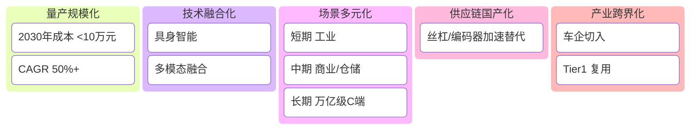

---
tags:
  - 导航
created: 2026-07-11
---

# 🤖 机器人产业知识库 - 导览页

> 🚀 **2026年**是人形机器人从"技术验证期"正式迈入 **"规模化量产元年"** 的关键拐点。中国供应链占据全球核心地位。

---

## 一、市场热度速览

> [!info]- 📈 行情核心指标（2026.07）
> ```mermaid
> kanban
>   板块总市值
>     约 **<font color="#f5dc87">27.43</font>** 万亿元
>   单日成交额
>     达 **<font color="#f5dc87">9400</font>** 亿元+
>   人形机器人指数
>     单日 **<font color="#ff0000">+5%</font>**
>   ETF 最高涨幅
>     **<font color="#f5dc87">9.37%</font>**
>   涨停个股
>     **<font color="#f5dc87">50+</font>** 只
>   主力资金排名
>     **rank/N** 名
>```


> [!tip]- ⚡ 四大催化因子
> - 🏛️ **政策**：万台级落地目标 - 杭州首部具身智能法规
> - 🏭 **产业**：特斯拉 Optimus Gen3 量产 - 智元 G2 下线 15000 台
> - 💎 **资本**：Q1 融资 681 亿元，超 2025 年总和
> - 🧬 **技术**：大模型+半马赛事 - Figure 03 连续作业 30h
>
> 🔥 **引爆点**：[[宇树科技]] 获批科创板 IPO，全球出货占比 **32.4%**

---

## 二、产业链全景
>[!important]- **产业链传导**
> - 上游（价值 **<font color="#c00000">70%-80%</font>**）
> - 中游（价值 **<font color="#fac08f">10%-15%</font>**）
> - 下游
> ```mermaid
> graph TD
>     subgraph A["上游：核心零部件"]
>         A1[传动系统] --> A4[材料与技术]
>         A2[动力系统] --> A4[材料与技术]
>         A3[感知系统] --> A4[材料与技术]
>     end
> 
>     subgraph B["中游：本体与集成"]
>         B1[本体制造]
>         B2[系统集成]
>     end
> 
>     subgraph C["下游：实际应用"]
>         C1[工业 >60%]
>         C2[服务]
>         C3[特种]
>     end
>     A --> B --> C
> ```

> [!tips]+ **上游：零部件细分**
> ```mermaid
> graph LR
>     D1[传动<br>减速器-丝杠-轴承] --> D2[动力<br>电机-伺服-控制器] --> D3[感知<br>3D视觉-六维力-雷达] --> D4[材料芯片<br>PEEK-AI算力-MCU]
> ```

> [!tips]+ **下游：应用细分**
> ```mermaid
> graph LR
>     E1[工业<br>汽车-3C-新能源] --> E2[服务<br>仓储-医疗-商业] --> E3[特种<br>安防-救援-航天]
> ```

---
## 三、核心技术指标
>[!example]- **硬件核心指标**
> - 谐波减速器：精度 ≤30 弧秒 --> 成本较海外低 35%+
> - 伺服电机：扭矩密度 80 Nm/kg（接近 Optimus 的 90）
> - 行星滚柱丝杠：承载力为滚珠丝杠 3-6 倍 - 寿命 10-15 倍 - 单机成本占比约 9.85%

>[!bug]- **分层具身智能架构**
> ```mermaid
> graph TB
>     S1[认知大模型<br>全局规划/语义理解] --> S2[策略模型<br>动态环境修正] --> S3[物理控制器<br>1kHz 实时控制]
>     D[数据闭环<br>训练→部署→回流→优化] --> S1 & S2 & S3
> ```

---

## 四、核心企业图谱

>[!example]- **上游零部件**
> ```mermaid
> graph LR
>     U1[绿的谐波<br>谐波全球第二] --> U2[双环传动<br>RV减速器] --> U3[汇川技术<br>伺服市占>20%]
>     U4[鸣志电器<br>空心杯电机] --> U5[拓普集团<br>线性执行器] --> U6[奥比中光<br>3D视觉]
> ```

>[!example]- **中游整机与集成**
> ```mermaid
> graph LR
>     M1[宇树科技<br>出货全球第一] --> M2[智元机器人<br>万台下线] --> M3[优必选<br>工业人形]
>     M4[埃斯顿<br>本体出货第一] --> M5[新松机器人<br>产品线最全] --> M6[埃夫特<br>喷涂/打磨]
> ```

> [!example]- **海外标杆**
> ```mermaid
> graph LR
>     O1[特斯拉Optimus<br>百万台产能] --> O2[四大家族<br>发那科-ABB-库卡] --> O3[Figure AI-Agility<br>工业物流新锐]
> ```

---

## 五、未来趋势



---

### 关联子笔记

>[!tips]- 🏗️待施工
> - 标的深度：
>     - [[绿的谐波研究]]
>     - [[特斯拉Optimus供应链]]
>     - [[宇树科技招股书]]
> - 专题概念：
>     - [[具身智能大模型]]
>     - [[PEEK轻量化材料]]
>     - [[行星滚柱丝杠]]
> - 政策汇总：
>     - [[2026具身智能地方性法规]]
> 

---