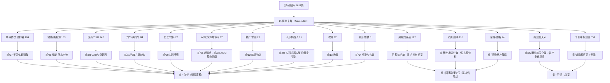

# 研报知识框架（肆 × 全库连接图）

> 把「肆 • 机构观点」这堆研报和整个知识框架连起来的总图。配合 [[00-连接诊断报告]] 看。
> 采集器跑一次 → 研报变多；本图与概念卡片、底稿里的 Dataview 区块会自动跟随，无需手工维护。

## 一、三层结构（Karpathy 式 wiki）

| 层 | 内容 | 维护方 | 刷新方式 |
|---|---|---|---|
| **Raw（原料）** | 1611 篇研报笔记（`研报_*.md`，frontmatter 含 concept/industry/object/rating） | 采集器 `fetch_reports.py` | 定时拉取东方财富 |
| **Auto-index（自动索引）** | 15 张概念卡片 + `00-研报概念速览` + `00-研报时间线` + `研报概念架构.canvas` + `研报逆检索索引` | `_gen_obsidian.py` | 跑生成器（已修路径/元数据） |
| **Wiki（活页，LLM 拥有）** | 11 个概念底稿（含「共识综述」+ Dataview 反向链接）+ 本框架页 | 人工 / LLM | 持续积累，生成器重跑不覆盖共识综述 |

## 二、连接两条线
- **研报 → 概念 → 底稿**：每张研报笔记有「## 知识库交叉引用」指向概念卡片 + 逆检索板块；18 个底稿尾部有「## 机构观点（自动聚合）」Dataview 区块，按 concept 拉研报。
- **底稿 → 卡片**：底稿头部回链概念卡片；卡片「逆检索到的知识库板块」回链底稿。双向打通。

## 三、概念 → 底稿 映射（含篇数）

| 概念 | 篇数 | 对应底稿（贰/叁/伍） |
|---|---|---|
| 半导体/先进封装 | 184 | 贰/07 先进封装与Chiplet · 半导体设备全景 · 光模块全景 · TGV玻璃基板 |
| AI算力/算电协同 | 67 | 贰/01 超节点产业链 · 贰/08 AIDC与算电协同 · 贰/09 算电协同 |
| 储能/新能源 | 183 | 贰/08 固态电池全景 · 储能PCS四大演进 |
| 医药/CXO | 142 | 贰/03 CXO与创新药产业链 |
| 人形机器人 | 15 | 贰/02 人形机器人整机 · 具身智能 |
| 商业航天 | 4 | 贰/05 商业航天产业链全景 · 零 产业链传递总览 |
| 周期资源品 | 127 | 伍 铜钴核心上市公司名单 · 零 产业链传递总览 |
| 汽车/两轮车 | 84 | 贰/11 汽车与两轮车 |
| 物产/航运 | 20 | 贰/12 航运物流 |
| 消费/出海 | 116 | 贰 稀土永磁出海分析 · 伍 东鹏饮料 |
| 纸业/包装 | 8 | 贰/14 纸业与包装 |
| 金融/策略 | 24 | 叁 银行2026下半年投资策略 · 地产策略 |
| 化工/材料 | 72 | 贰/00 材料索引 |
| 教育 | 12 | 贰/13 教育 |
| 个股中报业绩 | 553 | 零 知识库总览（兜底型，按标的回各板块细看） |

## 四、框架图（Mermaid）

## 五、怎么用 / 怎么维护
- **从研报出发**：打开概念卡片 → 看「共识综述」定调 → 点清单进具体研报 → 卡片底部跳到底稿深读。
- **从底稿出发**：底稿尾部「机构观点」区块自动列出相关研报，新增即现。
- **新增概念**：在 `贰 • 杂学/<编号> <主题>/` 建标准底稿（模板见 [[WIKI-SCHEMA]]），并把路径加进 `_gen_obsidian.py` 的 `CONCEPT_TO_BOARD`，重跑生成器即可。
- **已知残留**：已于 2026-08-30 清理（旧版生成器残留的脑机接口卡 + 陈旧 _meta.json 已删除）。

---
*本页为 Phase 3 交付：框架图 + 三层结构 + 概念→底稿映射。数据截至 2026-08-30（研报 1611 篇）。*
